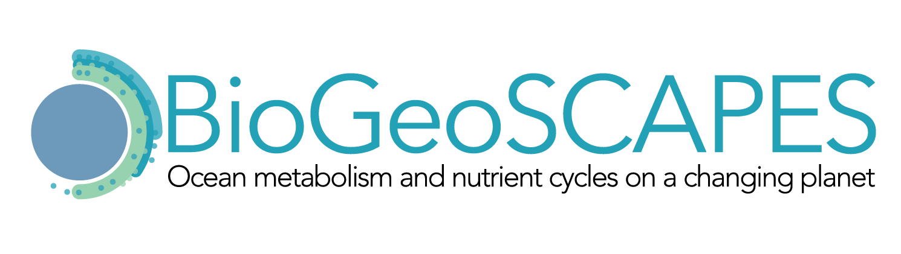

In an effort to explore and develop international community interest for a potential future “Biogeotraces-like” program to study the microbial biological and chemical oceanography of the oceans, a working group of 28 scientists from 9 nations met in Woods Hole in November 2018. There was strong interest in continuing this effort among the international participants, who agreed to act as ambassadors to communicate these discussions to their respective national communities. Please join us in building community support for this effort. The workshop report is [here](https://doi.org/10.5281/zenodo.4314954), and a list of national ambassadors is available [here](https://docs.google.com/spreadsheets/d/1lwYWRNgrVM_zfIcD0uksyRf_JohBgEkAgnEHDd6trrs/edit#gid=0) 

 
To join the email list contact <a href="mailto:mzawoysky@whoi.edu">here</a> 
For information contact: <a href="mailto:info@biogeoscapes.org">info@biogeoscapes.org</a> 
 

#### Upcoming Events
* BioGeoSCAPES has a major presence at the upcoming 2022 Ocean Sciences Meeting Virtual Meeting, with 65 submissions distributed into 5 sessions. OSM is February 24 - March 4, 2022 
The Sessions are titled: "Towards BioGeoSCAPES: Linking cellular metabolism with ocean biogeochemistry" under the topic Ocean Biology and Biogeochemistry
  * [BioGeoSCAPES Session 1](https://osm2022.secure-platform.com/a/solicitations/3/sessiongallery/schedule/items/40): Global Scale Processes (Mon. Feb. 28, 9AM)
  * [BioGeoSCAPES Session 2](https://osm2022.secure-platform.com/a/solicitations/3/sessiongallery/schedule/items/641): Southern Ocean Dynamics (Mon. Feb. 28, 10AM)
  * [BioGeoSCAPES Session 3](https://osm2022.secure-platform.com/a/solicitations/3/sessiongallery/schedule/items/642): Cyanobacteria and bacteria (Mon. Feb, 28, 11:30AM)
  * [BioGeoSCAPES Session 4](https://osm2022.secure-platform.com/a/solicitations/3/sessiongallery/schedule/items/643): Phosphorus and DOM (Fri. March 4, 11:30AM)
  * [BioGeoSCAPES Session 5](https://osm2022.secure-platform.com/a/solicitations/3/sessiongallery/schedule/items/644): Protists (Fri. March 4, 12:30PM)
  * BioGeoSCAPES posters are included within the two poster sessions on Wed. March 2: the [7-9pm EST poster session](https://osm2022.secure-platform.com/a/solicitations/3/sessiongallery/schedule/items/623) and the [9-11pm EST poster session](https://osm2022.secure-platform.com/a/solicitations/3/sessiongallery/schedule/items/624)
#### Recent Activities:
* A [US National Biogeoscapes Workshop](https://www.us-ocb.org/ocb-scoping-workshop-laying-the-foundation-for-a-potential-future-biogeoscapes-program/) supported by OCB November 10-12, 2021
* [OCB Ocean Metaproteome Intercomparison Effort](https://www.us-ocb.org/intercomparison-and-intercalibration-metaproteomics/) September 16-17th, 2021
* A couple of BioGeoSCAPES Sessions at the ASLO 2021 Aquatic Sciences Meeting in Palma de Mallorca, Spain (June 22-27) have been proposed, more information to follow.
* National Community Interest Meetings have occurred in Japan, the UK, Canada, China, and France
* Biogeoscapes Ocean Sciences Meeting Sessions in San Diego, CA (Feb 17-21, 2020) Sessions: [Thursday](https://agu.confex.com/agu/osm20/meetingapp.cgi/Session/93195), [Friday](https://agu.confex.com/agu/osm20/meetingapp.cgi/Session/93199), and [Posters](https://agu.confex.com/agu/osm20/meetingapp.cgi/Session/84717) February 20-21.
* Ocean Nucleic Acids 'omics Intercalibration and Standardization [Workshop](https://www.us-ocb.org/ocean-nucleic-acids-omics-workshop/) in January of 2020 

#### Newsletters:
- [Newsletter 3 - December 2020](2020_12_02_newsletter-3.md)
- [Newsletter 2 - February 2020](2020-02-05-newsletter-2.md)
- [Newsletter 1 - December 2019](2019-07-15-newsletter-1.md) 

Biogeoscapes has an active Twitter feed [@biogeoscapes](https://twitter.com/biogeoscapes), follow along news and related events, or post your own news <a href="https://twitter.com/intent/tweet?button_hashtag=biogeoscapes&ref_src=twsrc%5Etfw" class="twitter-hashtag-button" data-show-count="false">Tweet #biogeoscapes</a>.

<!-- Global site tag (gtag.js) - Google Analytics -->

